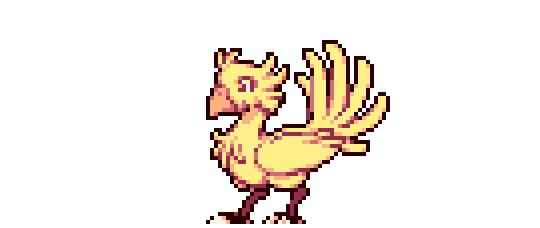
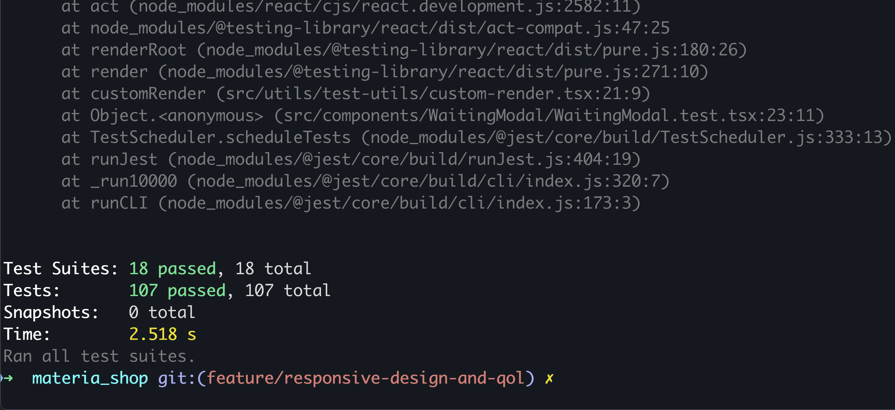
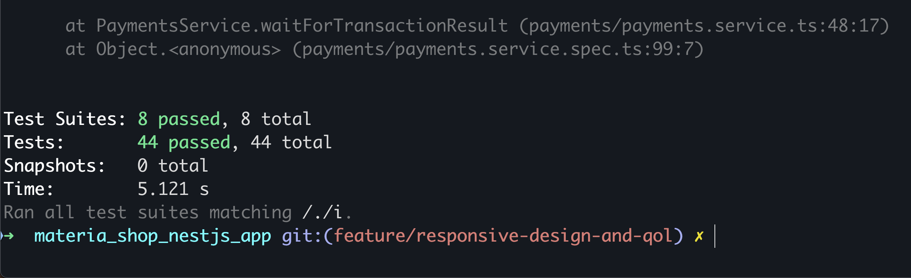

# Project Title

A web application to simulate an online store for buying Materia, inspired by Final Fantasy 7.

## Table of Contents

- [Project Title](#project-title)
  - [Table of Contents](#table-of-contents)
  - [Getting Started](#getting-started)
  - [Features](#features)
  - [Technologies Used](#technologies-used)
    - [Frontend](#frontend)
    - [Backend](#backend)
  - [Backend Endpoints:](#backend-endpoints)
    - [Users Module](#users-module)
    - [Products Module](#products-module)
    - [Orders Module](#orders-module)
    - [Payments Module](#payments-module)
  - [Architecture and Infrastructure](#architecture-and-infrastructure)
  - [Installation](#installation)
  - [Usage](#usage)
  - [Integration with WOMPI API](#integration-with-wompi-api)
  - [Database Structure](#database-structure)
    - [Users Table](#users-table)
    - [Products Table](#products-table)
    - [Orders Table](#orders-table)
    - [Payments Table](#payments-table)
  - [Other Relevant Information](#other-relevant-information)
    - [Compromises with Serverless Approach](#compromises-with-serverless-approach)
    - [Final Fantasy Theme](#final-fantasy-theme)
    - [WOMPI API Limitations](#wompi-api-limitations)
    - [Hexagonal Architecture](#hexagonal-architecture)
    - [Railway Oriented Programming](#railway-oriented-programming)
  - [Unit Testing Results (As per January 16th, 2025)](#unit-testing-results-as-per-january-16th-2025)
  - [Contributing](#contributing)
  - [License](#license)

## Getting Started

This web application is built to simulate an online store for buying Materia, the magic orbs from Final Fantasy 7. Users can:

1. Select one of 10 characters from the game.
2. Browse and add Materia (over 20 types) to their cart.
3. View detailed descriptions of Materia items.
4. Enter credit card information (sandbox environment, no real transactions).
5. Accept terms and conditions required by Colombian authorities.
6. View a summary of the order, including price, order number, and payment status.
7. Return to the homepage after completing the purchase.

## Features

- User-friendly shopping cart for Materia items.
- Sandbox payment processing.
- Final Fantasy 7-inspired UI and UX.
- Responsiveness across devices.
- Secure and efficient backend built with Nest.js.
- Integration with the WOMPI API for payment processing.

## Technologies Used

### Frontend

- **React**: For building the user interface.
- **SASS**: For styles.
- **Jest**: For unit testing.
- **React Router**: For navigation and routing.
- **React Query**: For HTTP requests.
- **Redux**: For state management.

### Backend

- **Nest.js**: To handle user, product, payment, and order logic.
- **DynamoDB**: For database management.
- **Jest**: For unit testing.

## Backend Endpoints:

### Users Module

- **GET /users**: Fetches all users. Returns a list of user objects.
- **GET /users/:id**: Fetches a single user by their ID. Returns the user object.

### Products Module

- **GET /products**: Fetches all products. Returns a list of product objects.
- **GET /products/:id**: Fetches a single product by its ID. Returns the product object.
- **PATCH /products**: Updates product stock. Accepts a list of updates (product ID, stock variation, and operation type). Returns the updated product objects. Used to update the stock of each product after a complete purchase.

### Orders Module

- **GET /orders**: Fetches all orders. Returns a list of order objects.
- **GET /orders/:id**: Fetches a single order by its ID. Returns the order object.
- **POST /orders**: Creates a new order. Accepts an order object. Returns the created order.
- **PATCH /orders/:id**: Updates an existing order. Accepts an order ID and a partial order object. Returns the updated order.

### Payments Module

- **GET /payments/:id**: Fetches a payment by its ID. Returns the payment object.
- **POST /payments**: Creates a new payment. Accepts a payment object. Returns the created payment.

## Architecture and Infrastructure

The project follows a **hexagonal architecture**, ensuring modularity and independence between frontend, backend, and database layers. It is hosted on AWS with the following stacks:

1. **Serverless Stack**:

   - Lambda function hosting the NestJS backend.
   - API Gateway for exposing backend endpoints.
   - DynamoDB tables for users, products, orders, and payments.
   - Execution roles for secure communication between Lambda and DynamoDB.

2. **CICD Stack**:
   - CodePipeline for CI/CD, triggered by commits to the master branch.
   - Integration with AWS Secrets Manager for secure GitHub connections.
   - Steps for compilation, unit tests, code linting, and deployment.
   - S3 bucket for frontend hosting with a CloudFront distribution.
   - Automatic CloudFront cache invalidation to ensure users see the latest updates.

## Integration with WOMPI API

The payments module interacts with the WOMPI API to process transactions:

1. The frontend sends the following to the backend:
   - Tokenized credit card.
   - Acceptance tokens for terms and conditions.
2. The backend creates a payment source and initiates a transaction.
3. The backend monitors the transaction status (e.g., APPROVED, PENDING) and returns results to the frontend.

## Database Structure

The application uses DynamoDB with four main tables:

### Users Table

- `id` (UUID4)
- `email`
- `name`
- `portrait` (S3 object address)

### Products Table

- `id` (UUID4)
- `description`
- `materia_type` (MAGIC, INDEPENDENT, SUPPORT, SUMMON, COMMAND)
- `name`
- `picture` (S3 object address)
- `price`
- `stock_amount`

### Orders Table

- `id` (UUID4)
- `acceptance_token`
- `acceptance_auth_token`
- `address`
- `content` (list of product items)
- `creation_date`
- `order_status` (COMPLETED, CANCELLED, PENDING, FAILED)
- `payment_method`
- `total_order_price`
- `user_id`

### Payments Table

- `id` (UUID4)
- `acceptance_token`
- `acceptance_auth_token`
- `customer_email`
- `order` (Order ID)
- `payment_amount`
- `payment_status` (PENDING, APPROVED, FAILED)
- `tokenized_credit_card`
- `wompiTransactionId`

## Other Relevant Information

### Compromises with Serverless Approach

- Slower response times during Lambda cold starts.
- Cost-effective as Lambda runs only when needed.

### Final Fantasy Theme

- Inspired by the menus and aesthetics of Final Fantasy 7.
- Fonts, colors, icons, and sounds reflect the original game.

### WOMPI API Limitations

- Testing suggests APPROVED transactions only work within Colombia.
- Future updates will aim for broader international usability.

### Hexagonal Architecture

- Independent layers for frontend, backend, and database.
- Minimal interdependency among modules, except for orders and payments.

### Railway Oriented Programming

- Payment processing uses a step-by-step pipeline for predictable outcomes.

## Unit Testing Results (As per January 16th, 2025)

- Frontend unit testing:



- Backend unit testing:



## Contributing

Contributions are welcome! Please follow these steps:

1. Fork the repository.
2. Create a feature branch:
   ```bash
   git checkout -b feature/your-features
   ```
3. Commit your changes:
   ```bash
   git commit -m "Add your message here"
   ```
4. Push to the branch:
   ```bash
   git push origin feature/your-feature
   ```
5. Open a Pull Request.

## License

This project is licensed under the [MIT License](LICENSE).

---

Feel free to dive into the application and share your feedback! This project reflects my recently discovered passion for Final Fantasy 7 and my passion for software development. Every aspect of it, from the design to the functionality, has been crafted with care and enthusiasm to bring the best experience for the users. Enjoy!
